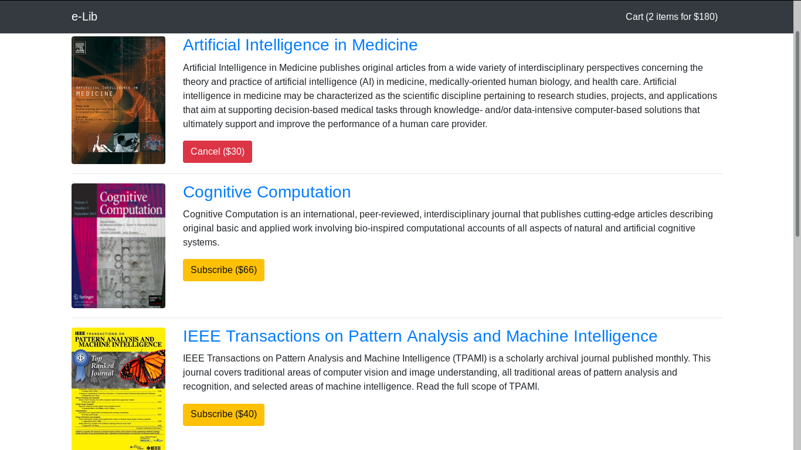
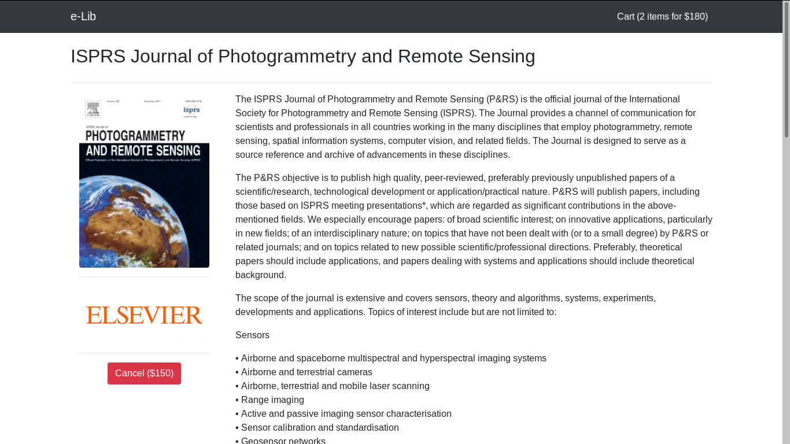
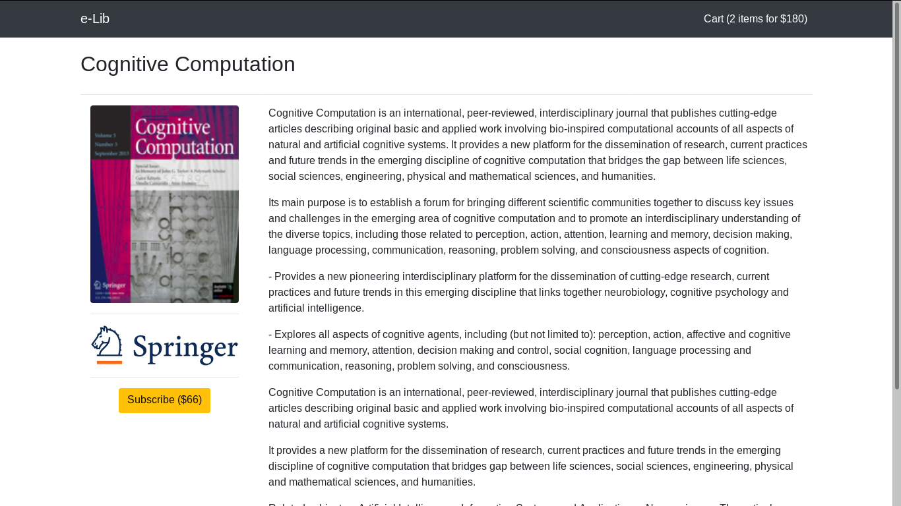
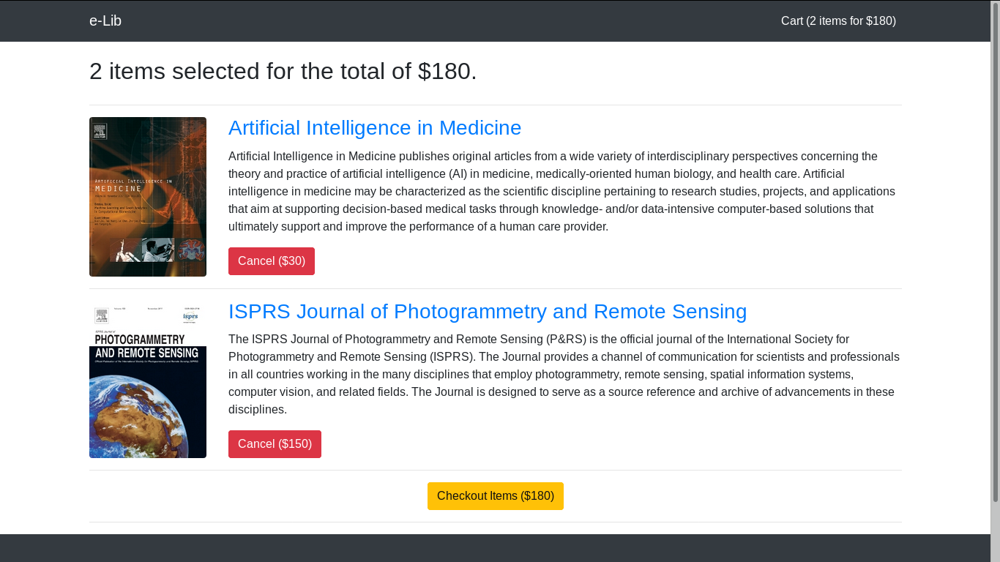

# django_lab

Pull this repository by:

    $ git clone https://github.com/BeeHappy/django_lab.git

Then install requirements by running the command (some manual installation with `apt-get` may still be required):

    $ pip install -r requirements.txt

And run the server using

    $ python manage.py runserver
